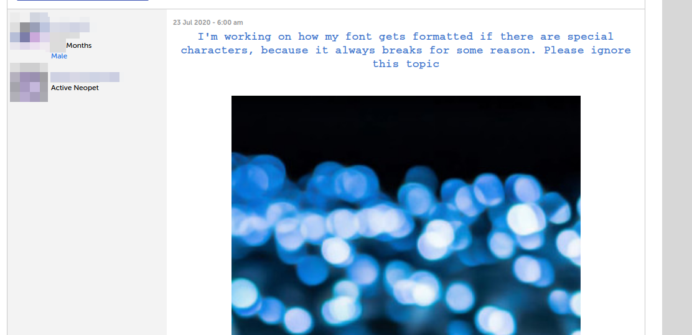
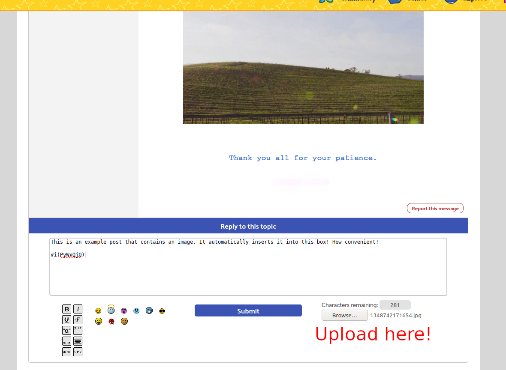
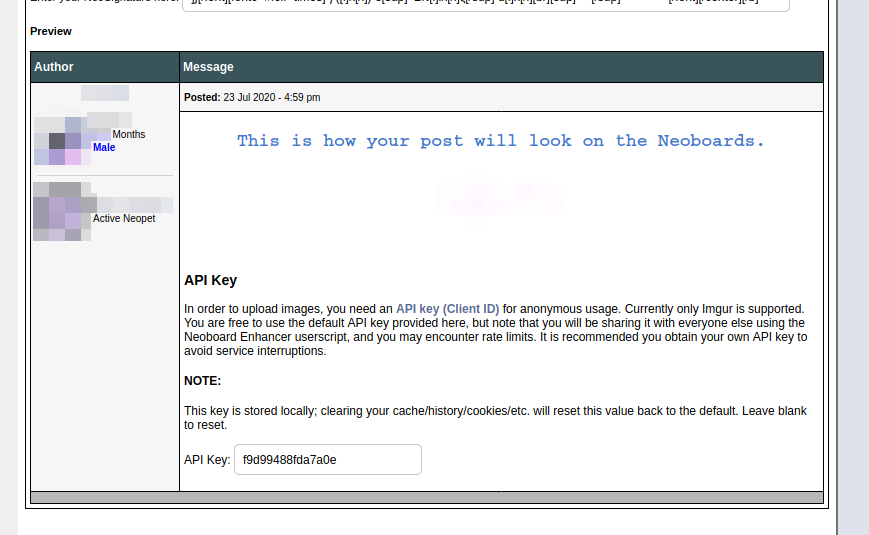

# Neoboard Enhancers

Fellow Neopets friends... Have you ever wanted to be able to post images on the Neoboards? Well now you can with this Tampermonkey script!

As of version 0.1, you can upload images directly from the Neoboards post reply or topic creator, and use them in your post. Supported filetypes are `.png`, `.gif`, and `.jpg`.

You can also include multiple images in one post too!

## Installation Instructions

0. Before anything else, install Greasemonkey if you haven't already.
1. Next, simply [click here to install](../../raw/master/neoboardenhancer.user.js)! This should automagically activate Tampermonkey that you're trying to install a new script. Install it.
2. DONE!

## Usage Instructions

**NOTE**: the script doesn't work properly on the Classic theme; you will need to use the Open Mobile beta.

From any topic or from the "Create Topic" page, locate the file uploader button underneath the character counter.

The script will automatically put the image code in your post for you. You do not need to do anything else.

## Notes

This script comes included with an API key for you to use. However, this will be shared by anyone who downloads the script, and there is a limited number of pictures that can be uploaded with the given API key per day (up to 1,250). To avoid this, you can get your own Client ID API key **for free** from Imgur and set it in your Neoboard preferences:

Also, note that only people with the script installed will be able to see the pictures. :)

There currently is no way to delete pictures once they're uploaded. However, after you upload a picture, you can open the developer console in your web browser to view the response data to find the delete hash from Imgur, where you can initiate a separate request to delete the picture from Imgur.
